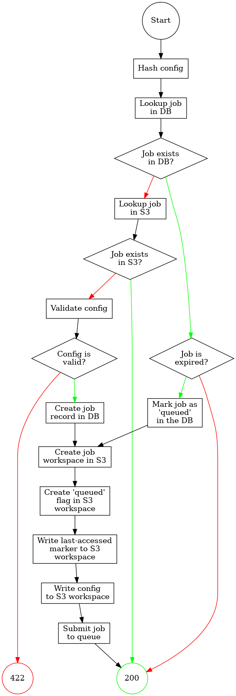
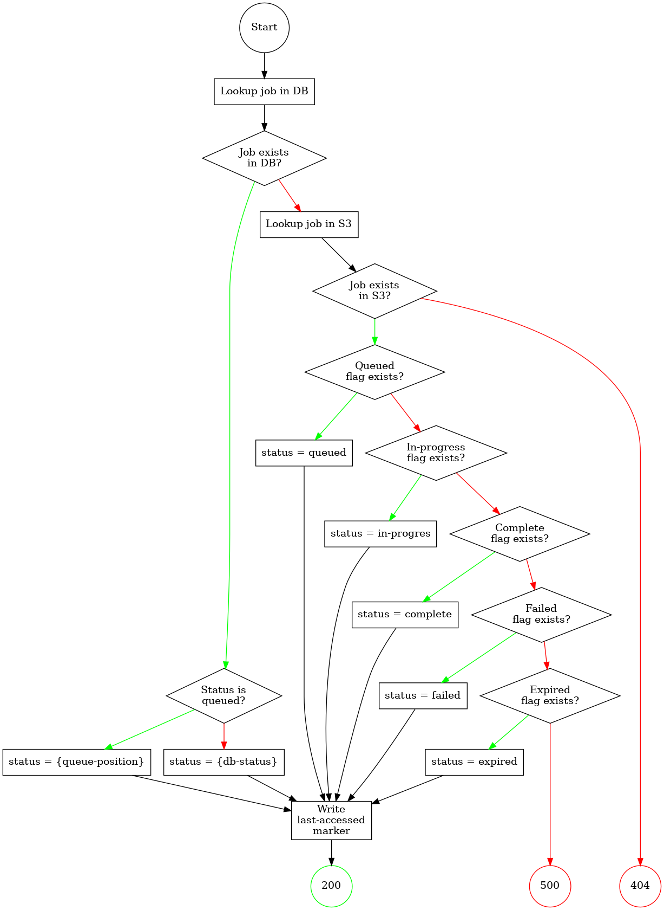
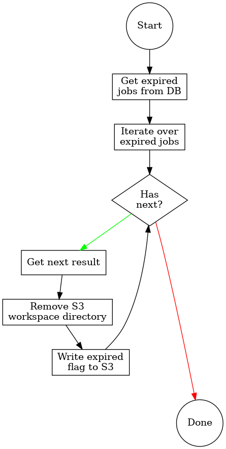

= Development / Design Notes
:toc:

== TODO

* Job inputs and outputs: +
  These are per service, so we need some way to determine/know what those
  inputs and outputs are. +
  The inputs are less of a problem than the outputs (unless the service wants
  to persist the inputs?)
** As part of the service configuration, they have to be registered?
** Provide methods/hooks to be implemented that choose the files?
** Directories in the scratch spaces, how will they be handled?
* Services may have their own queue setups.  For example, eda-compute will have
  at least 2 queues (6 channels), but other services may only want one or may
  want more.  Specifically in the case of eda-compute, the queue will be
  determined by the plugin, but how would other services decide things like
  this?
** Queue callbacks... These have to be configured per queue unless... well we
   could provide default callbacks and have hook points to perform custom logic
   on success/fail?

== Configuration

TODO!

== Workflows

=== Job Submission Request

=== Job Status Request

=== Service Startup

=== Cache Pruning

== Workspaces

=== S3

==== Flags & Markers

--
* Flags are additive to retain information about job status timestamps.
* Failed jobs never get an expired flag
--

`.complete`::
Flag object whose presence indicates that the job represented by the containing
workspace has finished successfully.
+
This flag should never coexist with the `.failed` flag.

`.expired`::
Flag object whose presence indicates that the job represented by the containing
workspace has expired.
+
This flag should never coexist with the `.failed` flag.

`.failed`::
Flag object whose presence indicates that the job represented by the containing
workspace has finished unsuccessfully.
+
This flag should never coexist with the `.complete` flag.

`.in-progress`::
Flag object whose presence indicates that the job represented by the containing
workspace is currently running.

`.queued`::
Flag object whose presence indicates that the job represented by the containing
workspace is currently queued.

===== Example Workspaces

.Queued Workspace
[source]
----
bucket/
 |- 248c90f867405129875083c6193edfcd
     |- .queued
     |- input-config
----

.In-Progress Workspace
[source]
----
bucket/
 |- 248c90f867405129875083c6193edfcd
     |- .in-progress
     |- .queued
     |- input-config
----

.Completed Workspace
[source]
----
bucket/
 |- 248c90f867405129875083c6193edfcd
     |- .complete
     |- .in-progress
     |- .queued
     |- input-config
     |- ... output files ...
----

.Failed Workspace
[source]
----
bucket/
 |- 248c90f867405129875083c6193edfcd
     |- .failed
     |- .in-progress
     |- .queued
     |- error.log
     |- input-config
     |- ... output files ...
----

.Expired Workspace
[source]
----
bucket/
 |- 248c90f867405129875083c6193edfcd
     |- .expired
     |- .completed
     |- .in-progress
     |- .queued
----

==== Job Outputs

TODO!

=== Local Scratch Workspace

==== Inputs & Outputs

TODO!

== Components

=== Service

=== RabbitMQ

=== PostgreSQL

==== Debug Credentials

TODO: Document debug user.

=== S3

== Notes & Thoughts

Unordered development notes.

=== Thoughts

==== TODO

* A failed job should not expire.  It should stay failed until manually cleared.
* Each campus should only prune jobs that they "own".
* Job executor provider/factory.  Need some hook to get a job executor when we
  pop a job from the queue.
* Platform configuration?
** Should this be a config file?  Should it be programmatic?  May need to be
   statically available.
* Can directories be persisted?
** How to handle this?

==== Handled

* Need to be able to have an arbitrary number of queues.
** How do we determine what queue a job goes to?  If multiple queues are baked
into the platform itself we need some sort of identifier for each queue.  It
will have to be part of the platform configuration.

=== Queries

* Insert new job
* Update job status
** Update from queued to grabbed
** Update from grabbed to finished (failed or complete)
** Update from grabbed to queued (dead job)
** Update from finished to expired (except failed stays in failed status)
* Get job status
* Get job queue position

=== Volumes

* postgres

