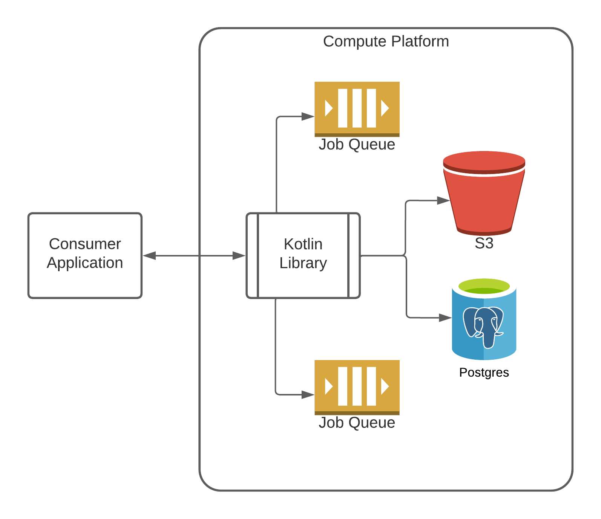

= Async Compute Core
:source-highlighter: highlightjs
:icons: font
:toc: preamble
ifdef::env-github[]
:tip-caption: :bulb:
:note-caption: :information_source:
:important-caption: :heavy_exclamation_mark:
:caution-caption: :fire:
:warning-caption: :warning:
endif::[]

image:https://img.shields.io/badge/jdk-17-blueviolet[title="JDK 17"]
image:https://github.com/VEuPathDB/lib-compute-platform/actions/workflows/build-on-commit.yml/badge.svg[link="https://github.com/VEuPathDB/lib-compute-platform/actions/workflows/build-on-commit.yml"]
image:https://img.shields.io/badge/docs-dokka-darkgreen[link="https://veupathdb.github.io/lib-compute-platform/dokka/"]
image:https://img.shields.io/badge/docs-javadoc-darkblue[link="https://veupathdb.github.io/lib-compute-platform/javadoc/"]

Base async job execution core.

Provides a platform for asynchronously executing arbitrary jobs and persisting
the results of those jobs.

== Usage

.build.gradle.kts
[source, kotlin]
----
dependencies {
  implementation("org.veupathdb.lib:compute-platform:1.5.0")
}
----

=== Interacting with the Platform

All interactions with this platform are handled through the
link:src/main/kotlin/org/veupathdb/lib/compute/platform/AsyncPlatform.kt[`AsyncPlatform`]
singleton.

After initialization, the platform exposes a minimal set of methods for
interactions:

. Job Submission
. Job Details Retrieval
. Job Result Retrieval
. Job Deletion

.Example Usage
[source, java]
----
// Initialize the platform
AsyncPlatform.init(config);

...

// Submit a job to the "my-queue" job queue
AsyncPlatform.submitJob("my-queue", someJobID, someJobConfig);

...

// Lookup the target job.
var job = AsyncPlatform.getJob(someJobID);

// If the job is in a "finished" status
if (job.status.isFinished()) {
  // Get the job's result files
  var results = AsyncPlatform.getJobResults(someJobID)

  // Do something with the result list
}

// Delete a failed job after cause of failure has been fixed
AsyncPlatform.deleteJob(someJobID);

----

The details of the queue, database, and S3 store management are internal to the
platform and are not exposed to library consumers except through callbacks.

=== Implementing Platform Interfaces

This library exposes 2 interfaces which library consumers must implement in
order to work with the platform:
link:src/main/kotlin/org/veupathdb/lib/compute/platform/job/JobExecutorFactory.kt[`JobExecutorFactory`]
and
link:src/main/kotlin/org/veupathdb/lib/compute/platform/job/JobExecutor.kt[`JobExecutor`].

The `JobExecutorFactory` implementation is responsible for creating new
instances of implementations of the `JobExecutor` interface.  This factory will
be provided context for which the `JobExecutor` is being requested to enable the
factory to provide an implementation suited for that context.

The `JobExecutor` implementations are responsible for performing the actual jobs
themselves.  This is where job execution specific logic should live or be called
from.

== Jobs

=== Statuses

Throughout the lifecycle of a job, the job will pass through a series of up to 4
of 5 possible statuses.  These statuses are:

. `queued`
. `in-progress`
. `complete`
. `failed`
. `expired`

When a job is first created, it is given the `queued` status and placed into the
job queue.  When it is pulled from the job queue to be executed, it is moved to
the `in-progress` status.  If the job completes its execution successfully, it
will be moved to the `complete` status, but if it fails or throws an exception,
it will be moved to the `failed` status.

Eventually, if the job goes a configurable number of days without being
accessed, the job will be pruned from the remote cache and will be moved to the
`expired` status.

=== Execution

Jobs are executed by `JobExecutor` implementations provided by the configured
`JobExecutorFactory`.  These types must be implemented by the library consumer.

When a job is pulled from the queue, the configured `JobExecutorFactory` will be
called to retrieve a `JobExecutor` instance which will be executed to perform
the desired job execution steps.

Job executors will be provided a temporary scratch workspace in the local
filesystem in which they can perform any filesystem operations necessary and
store their outputs to be persisted.

=== Output/Result Persistence

On completion, the local scratch workspace the job was executed in will be
scanned looking for any/all files that appear in the returned 'persistable
files' list.  Those files, if found, will be copied to the configured S3 store
to be cached until the job expires.

All possible outputs for whom caching is desired should be configured.  This
should include error logs or other outputs that would be used when investigating
or debugging a job failure.

Directories or files in subdirectories under the local scratch workspace root
may not be persisted.  Only files that exist directly under the local scratch
workspace root will be scanned when determining what files will be copied to S3.

== Configuration

Configuring the platform is done by calling the `AsyncPlatform.init()` method,
passing in an <<Async Platform Config,`AsyncPlatformConfig`>> instance.

The <<Async Platform Config,`AsyncPlatformConfig`>> type is constructable
through a builder that will validate the configuration before attempting to
initialize the platform.

=== Async Platform Config

[source, kotlin]
----
class AsyncPlatformConfig(
  internal val dbConfig: AsyncDBConfig,
  internal val s3Config: AsyncS3Config,
  internal val jobConfig: AsyncJobConfig,
  internal val queues: List<AsyncQueueConfig>,
  internal val localWorkspaceRoot: String = "/tmp/workspaces",
)
----

`dbConfig`::
+
--
An <<Async DB Config,`AsyncDBConfig`>> instance.

This value must not be `null`.
--

`s3Config`::
+
--
An <<S3 Options,`AsyncS3Config`>> instance.

This value must not be `null`.
--

`jobConfig`::
+
--
An <<Async Job Config,`AsyncJobConfig`>> instance.

This value must not be `null`.
--

`queues`::
One or more <<Queue Options>> instances.
+
The list of queue configs must not be empty.

`localWorkspaceRoot`::
+
--
Root path, on the service's local filesystem, in which job scratch spaces will
be created.

These scratch spaces are ephemeral, thus it is not necessary or recommended to
use a Docker volume to hold this root directory.

Default: `/tmp/workspaces`
--

.Builder Java
[source, java]
----
AsyncPlatformConfig.builder()
  .dbConfig(...)
  .s3Config(...)
  .jobConfig(...)
  .addQueue(...)
  .localWorkspaceRoot(...)
  .build()
----

.Builder Kotlin
[source, kotlin]
----
AsyncPlatformConfig.build {
  dbConfig { ... }
  s3Config { ... }
  jobConfig { ... }
  addQueue { ... }
  localWorkspaceRoot = ...
}
----

=== Async DB Config

Options for configuring the PostgreSQL instance that will be managed and
maintained by this library.

The PostgreSQL instance itself may be shared for multiple purposes within a
service stack, but this library should have a dedicated named database within
the instance.

[source, kotlin]
----
class AsyncDBConfig(
  internal val dbName: String,
  internal val username: String,
  internal val password: String,
  internal val host: String,
  internal val port: Int = 5432,
  internal val poolSize: Int = 10,
)
----

`dbName`::
Database name that will be used in the PostgreSQL instance to host the tables
and schema used by this library.

`username`::
PostgreSQL auth credentials username.  This user must have permissions to create
tables and schemata.

`password`::
PostgreSQL auth credentials password.  This user must have permissions to create
tables and schemata.

`host`::
Hostname of the PostgreSQL database that will be managed by this library.

`port`::
Host port of the PostgreSQL database that will be managed by this library.
+
Default: `5432`

`poolSize`::
Maximum connection pool size for connections to the database managed by this
library.
+
Default: `10`

.Builder Java
[source, java]
----
AsyncDBConfig.builder()
  .dbName(...)
  .username(...)
  .password(...)
  .host(...)
  .port(...)
  .poolSize(...)
  .build()
----

.Builder Kotlin
[source, kotlin]
----
AsyncDbConfig.build {
  dbName = ...
  username = ...
  password = ...
  host = ...
  port = ...
  poolSize = ...
}
----

=== S3 Options

Options for configuring connectivity with the S3 instance this library will use
to persist job results.

[source, kotlin]
----
class AsyncS3Config(
  internal val host: String,
  internal val port: Int = 80,
  internal val https: Boolean = false,
  internal val bucket: String,
  internal val accessToken: String,
  internal val secretKey: String,
  internal val rootPath: String = "/",
)
----

`host`::
Hostname of the S3 instance that will be used by this library.

`port`::
Host port of the S3 instance that will be used by this library.
+
Default: `80`

`https`::
Whether HTTPS should be used when communicating with the S3 server.
+
Default: `false`

`bucket`::
Name of the bucket that will be used by this library to persist job results.

`accessToken`::
Auth credentials access token that will be used by this library to communicate
with the S3 server.

`secretKey`::
Auth credentials secret key that will be used by this library to communicate
with the S3 server.

`rootPath`::
"Directory" (prefix) that will be used to hold all workspaces persisted to the
S3 store by this library.
+
Default: `/`

.Builder Java
[source, java]
----
AsyncS3Config.builder()
  .host(...)
  .port(...)
  .https(...)
  .bucket(...)
  .accessToken(...)
  .secretKey(...)
  .rootPath(...)
  .build()
----

.Builder Kotlin
[source, kotlin]
----
AsyncS3Config.build {
  host = ...
  port = ...
  https = ...
  bucket = ...
  accessToken = ...
  secretKey = ...
  rootPath = ...
}
----

=== Async Job Config

[source, kotlin]
----
class AsyncJobConfig(
  internal val executorFactory: JobExecutorFactory,
  internal val expirationDays: Int = 30
)
----

`executorFactory`::
+
--
Defines the provider/factory that will be used to instantiate new job executor
instances.

Job executors are defined/implemented by the library consumer and are
responsible for actually executing the job tasks.
--

`expirationDays`::
+
--
Defines the number of days a job's cache will be kept in S3 past the date of
last access.

Each time a job is accessed, its last accessed date will be updated and its
expiration will be this number of days out from the updated last accessed date.
--

.Builder Java
[source, java]
----
AsyncJobConfig.builder()
  .executorFactory(...)
  .expirationDays(...)
  .build()
----

.Builder Kotlin
[source, kotlin]
----
AsyncJobConfig.build {
  executorFactory = ...
  expirationDays = ...
}
----

=== Async Queue Config

Configuration of a single job queue.  Multiple queues may be defined.

[source, kotlin]
----
class AsyncQueueConfig(
  internal val id: String,
  internal val username: String,
  internal val password: String,
  internal val host: String,
  internal val port: Int,
  internal val workers: Int,
)
----

`id`::
A unique name/identifier assigned to a queue that is used to submit jobs to
specific target queues.
+
Assigning multiple queues the same name/ID will cause undefined behavior.

`username`::
RabbitMQ auth credentials username.

`password`::
RabbitMQ auth credentials password.

`host`::
Hostname of the RabbitMQ instance that will be used to back the queue being
configured.

`port`::
Host port of the RabbitMQ instance that will be used to back the queue being
configured.
+
Default: `5672`

`workers`::
Number of worker threads that will be spun up to consume jobs published to the
queue being configured.
+
Default: `5`

.Builder Java
[source, java]
----
AsyncQueueConfig.builder()
  .id(...)
  .username(...)
  .password(...)
  .host(...)
  .port(...)
  .workers(...)
  .build()
----

.Builder Kotlin
[source, kotlin]
----
AsyncQueueConfig.build {
  id = ...
  username = ...
  password = ...
  host = ...
  port = ...
  workers = ...
}
----

=== Examples

.Java Minimal
[source, java]
----
var config = AsyncPlatformConfig.builder()
  .addQueues(
    new AsyncQueueConfig("my-queue-1", "user", "pass", "queue-host-1"),
    new AsyncQueueConfig("my-queue-2", "user", "pass", "queue-host-2")
  )
  .jobConfig(new AsyncJobConfig(new MyJobExecutorFactory()))
  .dbConfig(new AsyncDBConfig("my-db-name", "user", "pass", "db-host"))
  .s3Config(new AsyncS3Config("s3-host", "my-bucket", "my-access-token", "my-secret-key"))
  .localWorkspaceRoot("/tmp")
  .build()
----

.Java Expanded
[source, java]
----
var AsyncPlatformConfig.builder()
  .addQueue(AsyncQueueConfig.builder()
    .id("my-queue-1")
    .username("user")
    .password("pass")
    .host("queue-host-1")
    .port(5672)
    .workers(5)
    .build())
  .addQueue(AsyncQueueConfig.builder()
    .id("my-queue-2")
    .username("user")
    .password("pass")
    .host("queue-host-2")
    .port(5672)
    .workers(5)
    .build())
  .jobConfig(AsyncJobConfig.builder()
    .executorFactory(new MyExecutorFactory())
    .expirationDays(30)
    .build())
  .dbConfig(AsyncDBConfig.builder()
    .host("db-host")
    .port(5432)
    .username("user")
    .password("pass")
    .dbName("my-db-name")
    .poolSize(10)
    .build())
  .s3Config(AsyncS3Config.builder()
    .host("s3-host")
    .port(80)
    .https(false)
    .bucket("my-bucket")
    .accessToken("my-access-token")
    .secretKey("my-secret-key")
    .rootPath("/")
    .build())
  .localWorkspaceRoot("/tmp")
  .build()
----

.Kotlin Minimal
[source, kotlin]
----
val config = AsyncPlatformConfig.builder()
  .addQueues(
    AsyncQueueConfig("my-queue-1", "user", "pass", "queue-host-1"),
    AsyncQueueConfig("my-queue-2", "user", "pass", "queue-host-2"),
  )
  .jobConfig(AsyncJobConfig(MyJobExecutorFactory()))
  .dbConfig(AsyncDBConfig("my-db-name", "user", "pass", "db-host"))
  .s3Config(AsyncS3Config("s3-host", "my-bucket", "my-acccess-token", "my-secret-key"))
  .localWorkspaceRoot("/tmp")
  .build()
----

.Kotlin Expanded
[source, kotlin]
----
val config = AsyncPlatformConfig.build {
  addQueue {
    id = "my-queue-1"
    username = "user"
    password = "pass"
    host = "queue-host-1"
    port = 5672
    workers = 5
  }

  addQueue {
    id = "my-queue-2"
    username = "user"
    password = "pass"
    host = "queue-host-2"
    port = 5672
    workers = 5
  }

  jobConfig {
    executorFactory = MyExecutorFactory()
    expirationDays = 30
  }

  dbConfig {
    host = "db-host"
    port = 5432
    username = "user"
    password = "pass"
    dbName = "my-db-name"
    poolSize = 10
  }

  s3Config {
    host = "s3-host"
    port = 80
    https = false
    bucket = "my-bucket"
    accessToken = "my-access-token"
    secretKey = "my-secret-key"
    rootPath = "/"
  }

  localWorkspaceRoot = "/tmp"
}
----

== Expiration

Job results expire after a configured period of time via background thread.  They
can also be manually expired in a service-specific implementation (e.g. if the service
knows results are invalid for some reason or via a custom expiration endpoint).

When a job is expired, it leaves behind a record in postgres and a (mostly empty)
directory with an expired-status file in Minio.  A new request for that job will
restart it, generating new results.  This model can lead to a complication when
multiple services are managing the same Minio instance (but have their own postgres
job status stores).  This is managed as follows:

==== From a clean DB...

North receives a job request

- checks for existence of job in PG and Minio (Minio wins) -> not present
- kicks off job; job status changes to one of: [ queued, running, complete, failed ]

During this process, South receives same job request

- checks for existence of job in PG and Minio -> present but not owned and not expired; just return status

==== Job expiration...

South cannot expire the job because it is not owned

North receives request to expire job or expiration thread expires job

- expires job in PG and Minio (South can only see Minio, South has no PG record)

==== Restarting and claiming expired jobs

If North receives same job request first...

- North looks in PG (owns the job + is expired) and Minio (job expired); they agree, so restarts the job and retains ownership
- If South gets request afterward, it sees the same thing as above (North owns non-expired job), so if later request comes in, does nothing

If South receives same job request first...

- South looks in PG (no record) and Minio (job expired); since expired, South creates new PG record, restarts job, and "steals" ownership
- If North gets request afterward, it sees expired record in PG, but non-expired in Minio.  It must delete its PG record, giving sole ownership to South

== Additional Topics

* link:docs/reference/database.adoc[Database Details]
* link:docs/reference/queues.adoc[Message Queues]

== Job Cache Management

Job outputs are automatically cached to the configured S3 store on job
completion for future retrieval.

Jobs will be kept in the S3 store until they expire at which point they are
subject to pruning.  Job expiration is configured when initializing the
platform.  By default, job results are kept 30 days after they were last
accessed, at which point they will be marked as expired and become available to
be pruned.

Job pruning happens every 12 hours automatically while the server is online,
with the first prune attempt happening on startup.

== To be organized:

=== Reserved file names:

* `.workspace`
* `.queued`
* `.in-progress`
* `.complete`
* `.failed`
* `.expired`
* `input-config`

